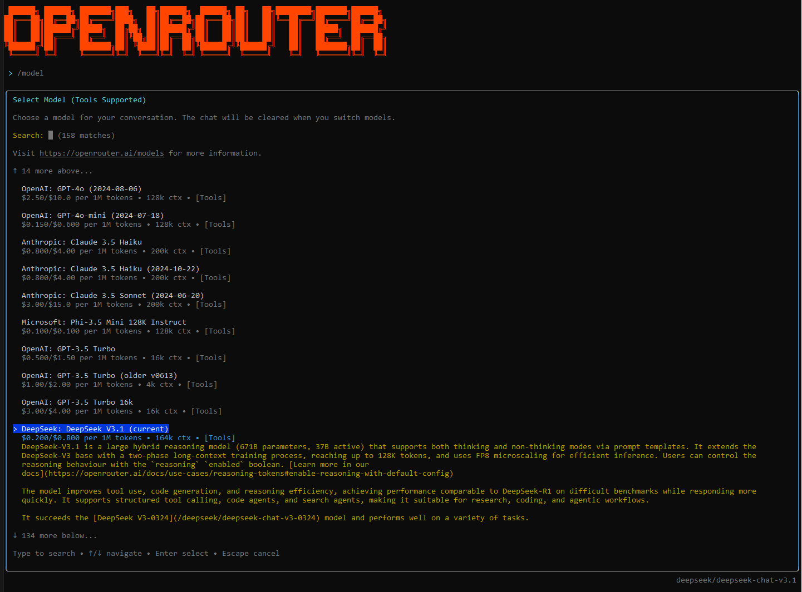

<h2 align="center">
 <br>
 
 <br>
 <br>
 OpenRouter Code CLI: Access any LLM model via OpenRouter in a customizable coding CLI
 <br>
</h2>

<p align="center">
 <a href="https://github.com/openrouter-code-cli/openrouter-code-cli/stargazers"></a>
 <a href="https://github.com/openrouter-code-cli/openrouter-code-cli/blob/main/LICENSE">
 
 </a>
</p>

<p align="center">
 <a href="#Overview">Overview</a> •
 <a href="#Installation">Installation</a> •
 <a href="#Usage">Usage</a> •
 <a href="#Development">Development</a>
</p>

<br>

https://github.com/user-attachments/assets/5902fd07-1882-4ee7-825b-50d627f8c96a

<br>

# Overview

The OpenRouter Code CLI gives you access to **any LLM model available on OpenRouter**, including Claude 3.5 Sonnet, GPT-4, Llama 3, Gemini, and many more. This is a customizable, lightweight, and open-source coding CLI that serves as a blueprint for developers looking to leverage, customize, and extend a CLI to be entirely their own.

Unlike other coding CLIs that are locked to a single provider, OpenRouter Code CLI lets you choose the perfect model for each task. Want Claude's reasoning? GPT-4's creativity? Or the speed of smaller models? Simply use `/model` to switch between any available model on OpenRouter.

OpenRouter Code CLI is your chance to make a CLI truly your own while having access to the best AI models available. Equipped with all of the features, tools, commands, and UI/UX that's familiar, we make it simple to add new features you've always wanted. Simply activate the CLI by typing `openrouter` in your terminal. Use it in any directory just like you would with any other coding CLI.

A few customization ideas to get started:
- New slash commands (e.g. /mcp, /deadcode, /complexity, etc.)
- Additional tools (e.g. web search, merge conflict resolver, knowledge graph builder, etc.)
- Custom start-up ASCII art
- Change the start-up command
- Anything you can think of!


## Installation

### For Development (Recommended)
```bash
git clone https://github.com/openrouter-code-cli/openrouter-code-cli.git
cd openrouter-code-cli
npm install
npm run build
npm link        # Enables the `openrouter` command in any directory
```

```bash
# Run this in the background during development to automatically apply any changes to the source code
npm run dev  
```

### To Try it Out
```bash
npx openrouter-code-cli@latest
```

## Usage
```bash
# Start chat session
openrouter
```

### Command Line Options

```bash
openrouter [options]

Options:
  -t, --temperature <temp>      Temperature for generation (default: 1)
  -s, --system <message>        Custom system message
  -d, --debug                   Enable debug logging to debug-agent.log in current directory
  -h, --help                    Display help
  -V, --version                 Display version number
```

### Authentication

On first use, start a chat:

```bash
openrouter
```

And type the `/login` command:


>Get your API key from the <strong>OpenRouter Console</strong> [here](https://openrouter.ai/keys)

This creates a .openrouter/ folder in your home directory that stores your API key, default model selection, and any other config you wish to add.

You can also set your API key for your current directory via environment variable:
```bash
export OPENROUTER_API_KEY=your_api_key_here
```

### Available Commands
- `/help` - Show help and available commands
- `/login` - Login with your OpenRouter API key
- `/model` - Select from any OpenRouter model (e.g., `anthropic/claude-3.5-sonnet`, `openai/gpt-4-turbo`, `meta-llama/llama-3.1-70b-instruct`)
- `/clear` - Clear chat history and context
- `/reasoning` - Toggle display of reasoning content in messages

### Popular OpenRouter Models
- `anthropic/claude-3.5-sonnet` - Claude 3.5 Sonnet (excellent for coding)
- `openai/gpt-4-turbo` - GPT-4 Turbo
- `google/gemini-pro-1.5` - Gemini Pro 1.5
- `meta-llama/llama-3.1-70b-instruct` - Llama 3.1 70B
- `mistralai/mistral-large` - Mistral Large
- And many more! See full list at [openrouter.ai/models](https://openrouter.ai/models)


## Development

### Testing Locally
```bash
# Run this in the background during development to automatically apply any changes to the source code
npm run dev  
```

### Available Scripts
```bash
npm run build      # Build TypeScript to dist/
npm run dev        # Build in watch mode
```

### Project Structure

```
openrouter-code-cli/
├── src/
│   ├── commands/           
│   │   ├── definitions/        # Individual command implementations
│   │   │   ├── clear.ts        # Clear chat history command
│   │   │   ├── help.ts         # Help command
│   │   │   ├── login.ts        # Authentication command
│   │   │   ├── model.ts        # Model selection command
│   │   │   └── reasoning.ts    # Reasoning toggle command
│   │   ├── base.ts             # Base command interface
│   │   └── index.ts            # Command exports
│   ├── core/               
│   │   ├── agent.ts            # AI agent implementation
│   │   └── cli.ts              # CLI entry point and setup
│   ├── tools/              
│   │   ├── tool-schemas.ts     # Tool schema definitions
│   │   ├── tools.ts            # Tool implementations
│   │   └── validators.ts       # Input validation utilities
│   ├── ui/                 
│   │   ├── App.tsx             # Main application component
│   │   ├── components/     
│   │   │   ├── core/           # Core chat TUI components
│   │   │   ├── display/        # Auxiliary components for TUI display
│   │   │   └── input-overlays/ # Input overlays and modals that occupy the MessageInput box
│   │   └── hooks/          
│   └── utils/              
│       ├── constants.ts        # Application constants
│       ├── file-ops.ts         # File system operations
│       ├── local-settings.ts   # Local configuration management
│       └── markdown.ts         # Markdown processing utilities
├── docs/                   
├── package.json    
├── tsconfig.json        
└── LICENSE          
```

**TL;DR:** Start with `src/core/cli.ts` (main entry point), `src/core/agent.ts`, and `src/ui/hooks/useAgent.ts` (bridge between TUI and the agent). Tools are in `src/tools/`, slash commands are in `src/commands/definitions/`, and customize the TUI in `src/ui/components/`.

### Customization

#### Adding New Tools

Tools are AI-callable functions that extend the CLI's capabilities. To add a new tool:

1. **Define the tool schema** in `src/tools/tool-schemas.ts`:
```typescript
export const YOUR_TOOL_SCHEMA: ToolSchema = {
  type: 'function',
  function: {
    name: 'your_tool_name',
    description: 'What your tool does',
    parameters: {
      type: 'object',
      properties: {
        param1: { type: 'string', description: 'Parameter description' }
      },
      required: ['param1']
    }
  }
};
```

2. **Implement the tool function** in `src/tools/tools.ts`:
```typescript
export async function yourToolName(param1: string): Promise<ToolResult> {
  // Your implementation here
  return createToolResponse(true, result, 'Success message');
}
```

3. **Register the tool** in the `TOOL_REGISTRY` object and `executeTool` switch statement in `src/tools/tools.ts`.

4. **Add the schema** to `ALL_TOOL_SCHEMAS` array in `src/tools/tool-schemas.ts`.

#### Adding New Slash Commands

Slash commands provide direct user interactions. To add a new command:

1. **Create command definition** in `src/commands/definitions/your-command.ts`:
```typescript
import { CommandDefinition, CommandContext } from '../base.js';

export const yourCommand: CommandDefinition = {
  command: 'yourcommand',
  description: 'What your command does',
  handler: ({ addMessage }: CommandContext) => {
    // Your command logic here
    addMessage({
      role: 'system',
      content: 'Command response'
    });
  }
};
```

2. **Register the command** in `src/commands/index.ts` by importing it and adding to the `availableCommands` array.

#### Changing Start Command
To change the start command from `openrouter`, change `"openrouter"` in `"bin"` of `package.json` to your global command of choice.

Re-run `npm run build` and `npm link`.


## Contributing and Support

Improvements through PRs are welcome!

For issues and feature requests, please open an issue on GitHub.

## License

MIT